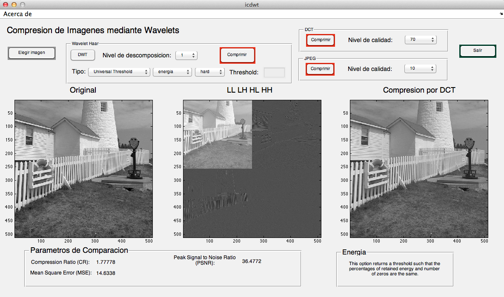
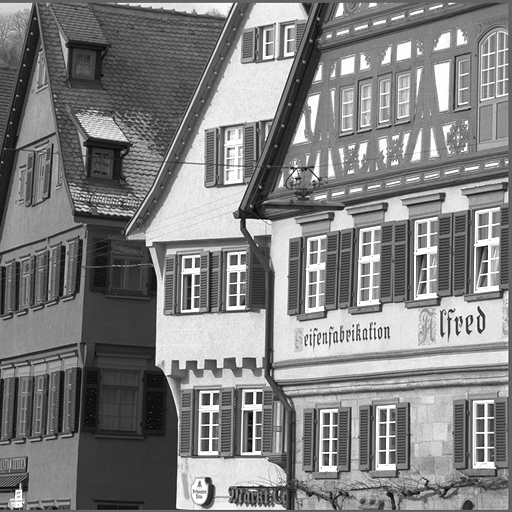
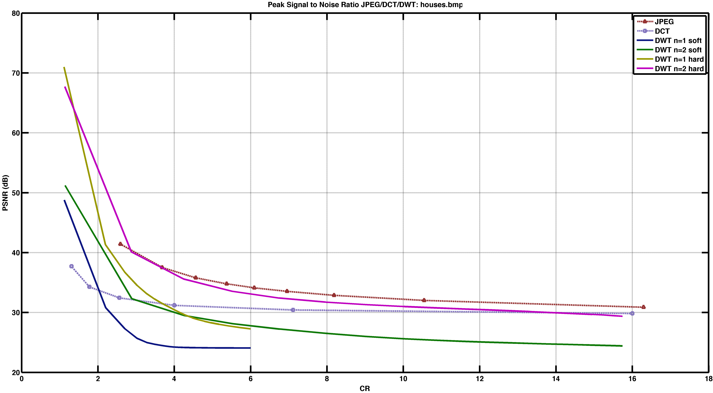
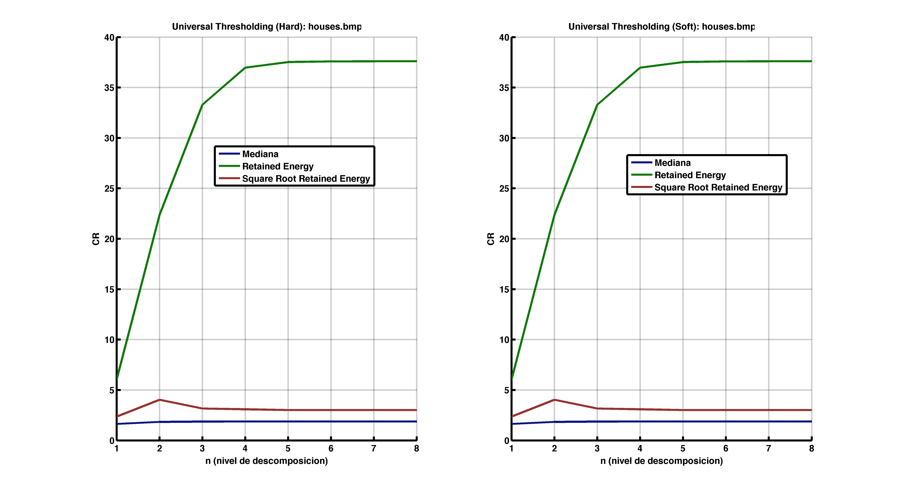

## Image compression using Wavelet transform 

**icdwt** is a MATLAB GUI tool which compresses _bmp_ images using the Discrete Wavelet Transform (DWT) and compares the results with several compression techniques like JPG and Discrete Cosine Transform (DCT). The metrics that **icdwt** uses are the [Compression Ratio](https://en.wikipedia.org/wiki/Data_compression_ratio) (CR) and [Peak Signal to Noise Ratio](https://en.wikipedia.org/wiki/Peak_signal-to-noise_ratio) (PSNR) with good results.

For the tests it has been used the following image (in its _bmp_ version),

And some results were:

* In the first figure it can be seen the PSNR vs CR for JPEG, DCT and DWT methods.

* In the last image it can be illustrate the variation of CR as a function of the level of decomposition for _hard_ and _soft_ *Universal Thresholding*. 

For more information check the following [document](https://github.com/ahestevenz/icdwt/blob/master/doc/image_compression.pdf) in Spanish.

